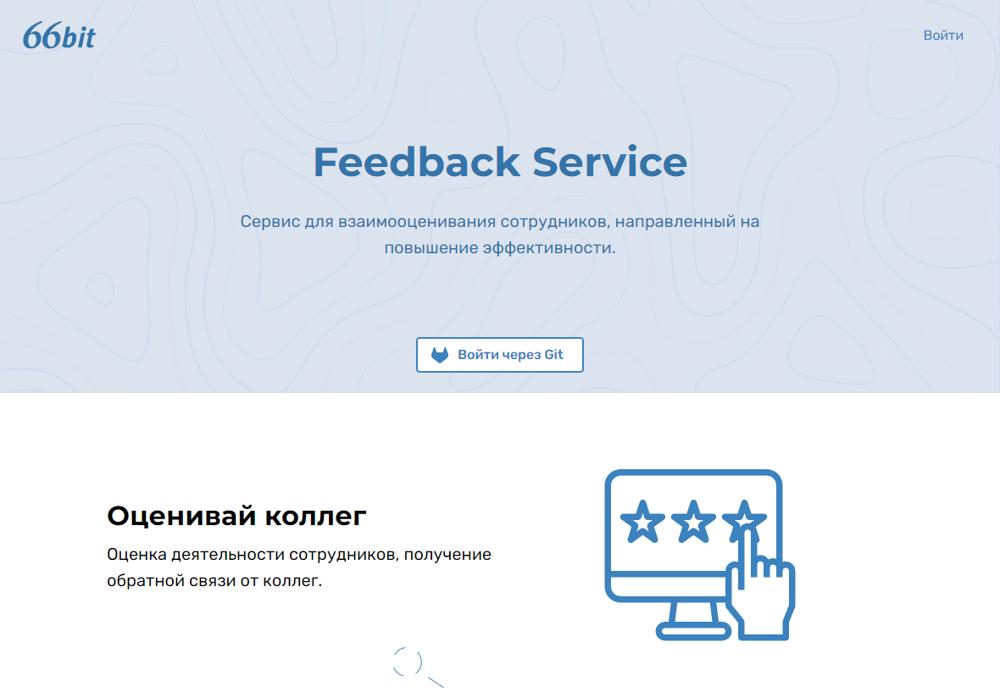
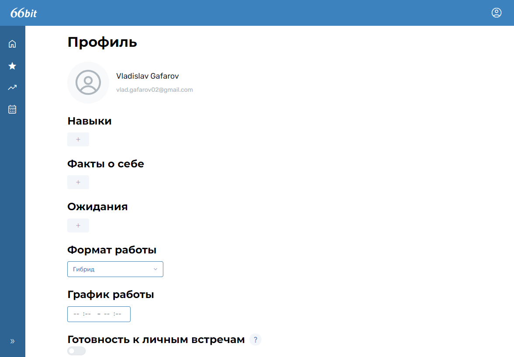
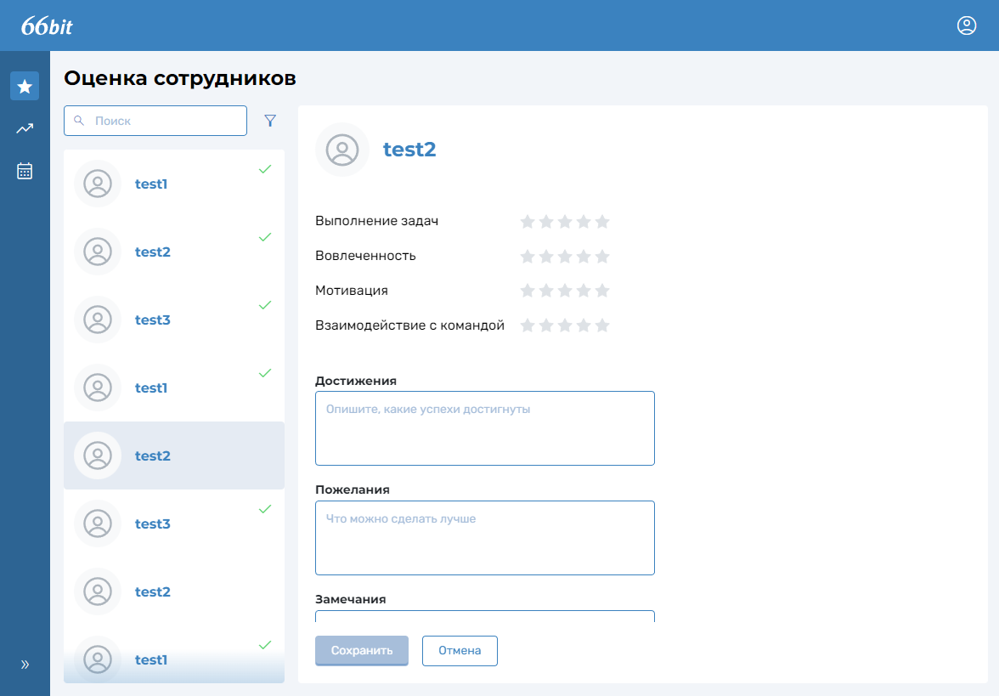
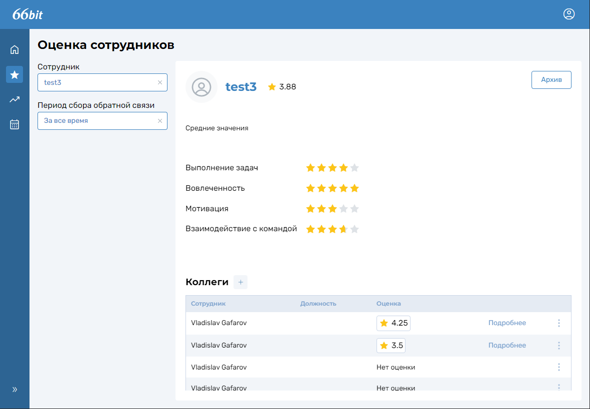
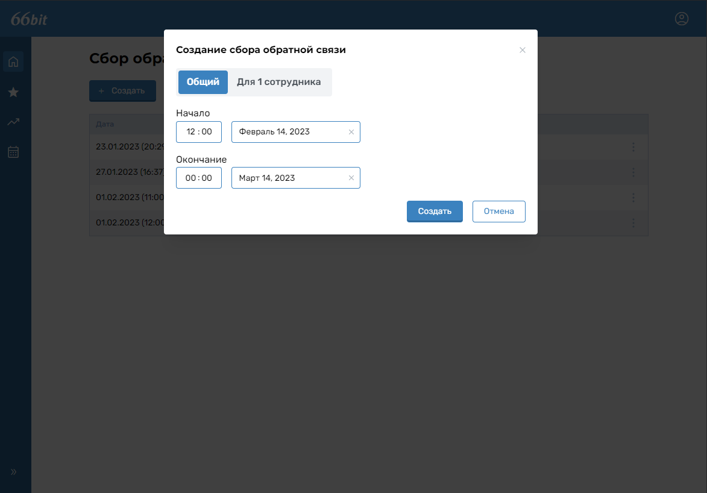
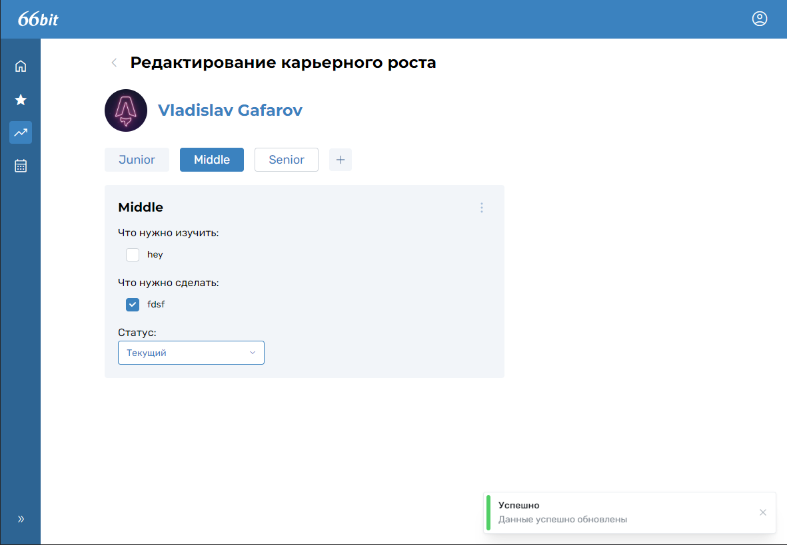

# Feedback service

Студенческий проект, предназначенный для сбора обратной связи от сотрудников в компании. Позволяет собирать отзывы, анализировать их и делиться с другими сотрудниками.

**Стек** - React/Next.js, MantineUI, react-query, final-form, zustand

**Особенности**
- Авторизация через GitLab
- Режим администратора
- Валидация форм с помощью final-form
- [FSD](https://feature-sliced.design) архитектура

